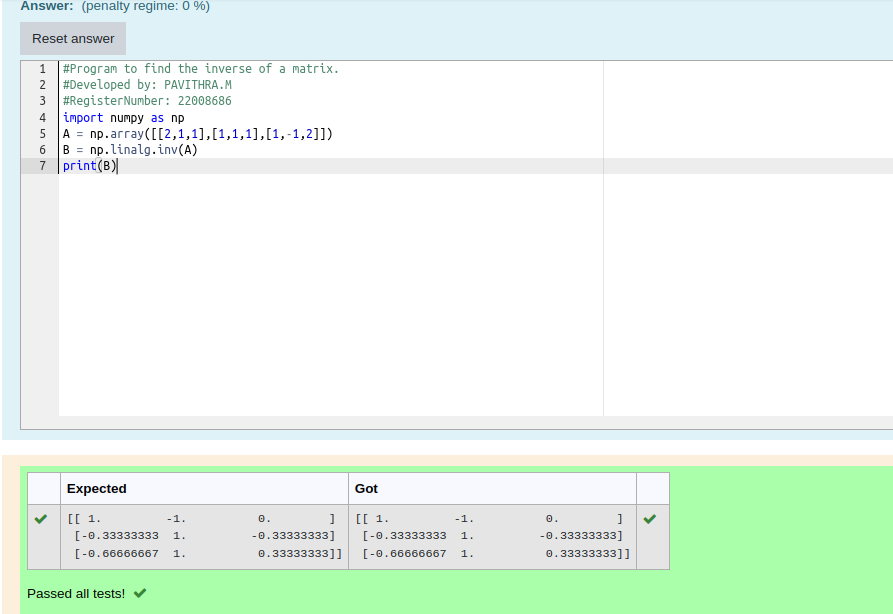

# INVERSE-OF-A-MATRIX
## Aim:

To write a python program to find the inverse of a matrix
## Equipment’s required:

1. 	Hardware – PCs

2. 	Anaconda – Python 3.7 Installation / Moodle-Code Runner

## Algorithm:

step 1:Import the numpy package
step 2:Get the input matrix
step 3:Find the inverse matrix
step 4:Print the result

## Program: 

```python
#Program to find the inverse of a matrix.
#Developed by: PAVITHRA.M
#RegisterNumber: 22008686
import numpy as np
A = np.array([[2,1,1],[1,1,1],[1,-1,2]])
B = np.linalg.inv(A)
print(B)
```
## Output:


## Result:

Thus the inverse of given matrix is successfully solved using python program